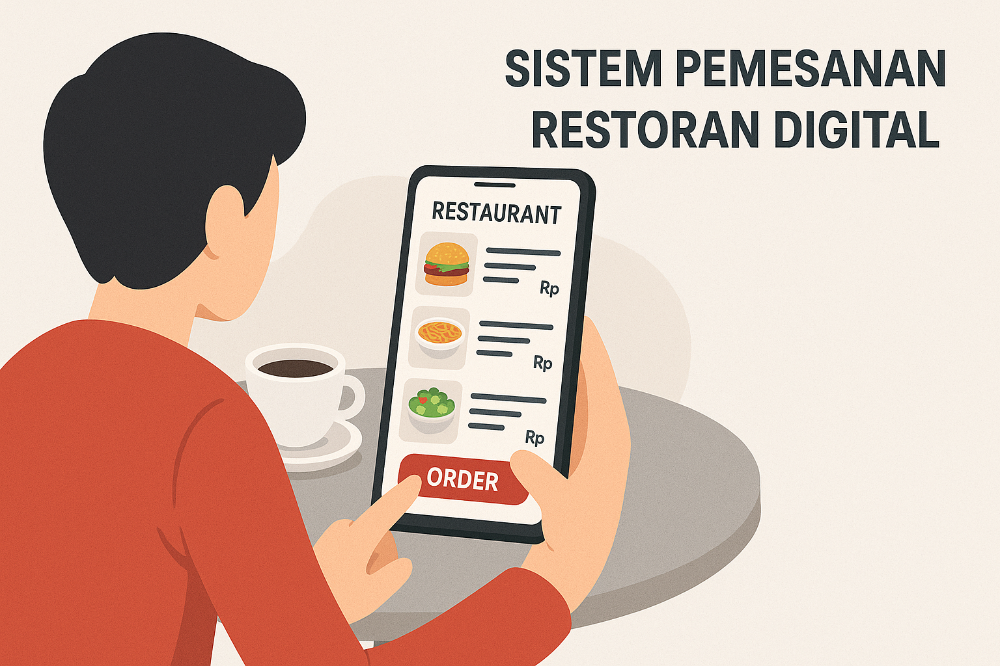

    

## About System

Ini adalah core dari sistem pemesanan restoran digital karna disini semua alur mulai dari reservasi meja, pemesanan menu, hingga pembayaran dikelola di sistem ini.

- Laporan: [Laporan](https://docs.google.com/document/d/1qJ1T8KTdarmu9vl6iZWbhiY04Dx-n3g0rSL8awmW69A/edit?usp=sharing)

## Features
<!-- Pelanggan -->

Fitur Pelanggan

### Fitur yang bisa dilakukan pelanggan

- Melakukan autentikasi
- Reservasi meja dan atur kedatangan
- Pemesanan menu dari katalog digital
- Pembayaran makanan
- Menerima notifikasi

<!-- Pelayan -->

Fitur Pelayan

### Fitur yang bisa dilakukan pelayan

- Verifikasi kehadiran pelanggan
- Pemesanan langsung ditempat (untuk pelanggan walk-in)
- Lihat status meja & Antrian

<!-- Koki -->

Fitur Koki

### Fitur yang bisa dilakukan koki

- Dashboard untuk melihat urutan daftar pesanan
- Bisa merubah status pesanan

<!-- Admin -->

Fitur Admin

### Fitur yang bisa dilakukan admin

- Manajemen menu seperti harga, ketersediaan dan harga
- Manajemen meja seperti mengatur kapasitas dan ketersediaan 
- Kelola reservasi & laporan seperti monitoring reservasi yang masuk dan status kehadiran

